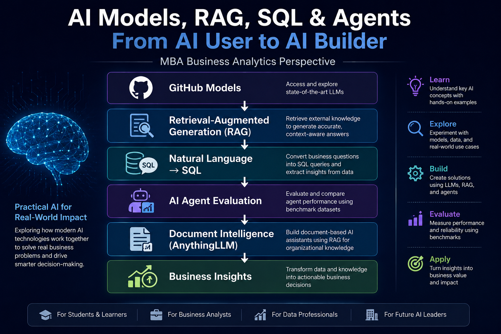
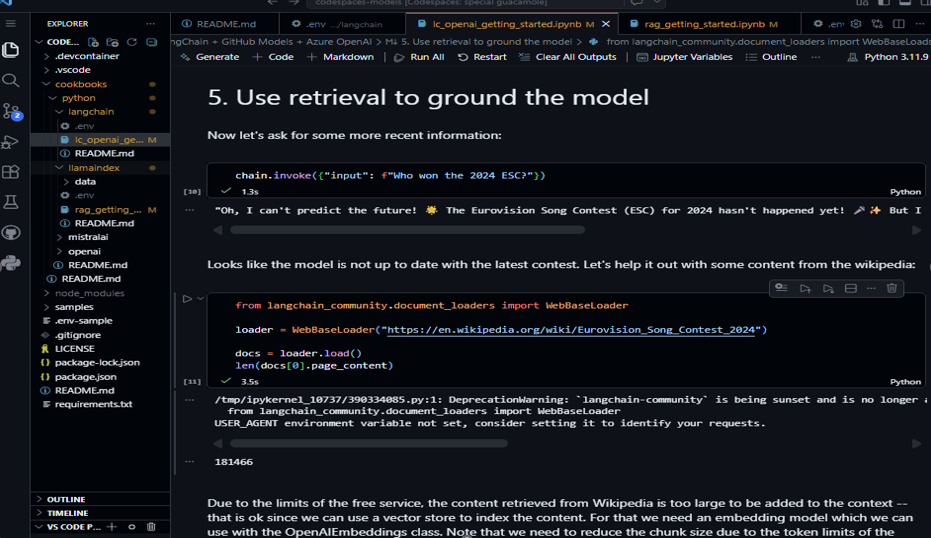
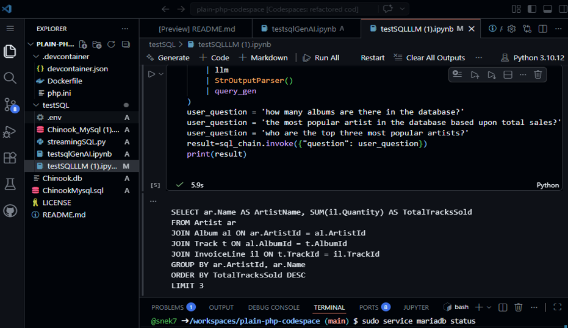
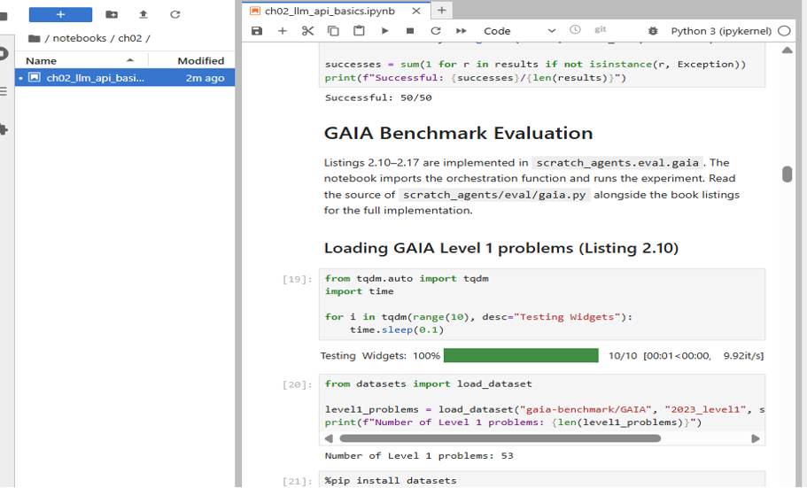
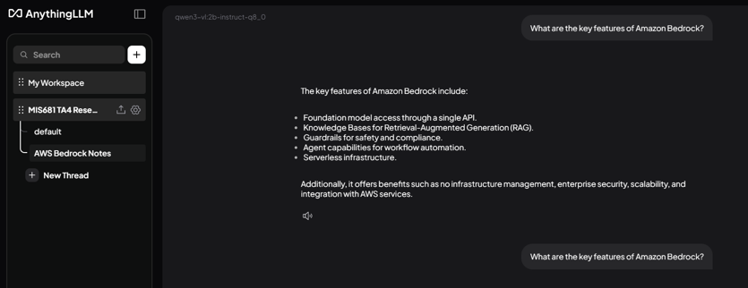

## From AI User to AI Builder

A beginner-friendly, hands-on guide to understanding how modern AI systems work beyond prompting.

This repository documents my exploration of:

* GitHub Models (GPT-5 & GPT-5-mini)
* Retrieval-Augmented Generation (RAG)
* LangChain
* LlamaIndex
* Natural Language to SQL using MariaDB
* AI Agent Evaluation & Benchmarking
* Document Intelligence with AnythingLLM

As an MBA Business Analytics candidate and former SAP consultant, my goal was not only to use AI tools but also to understand how they can be connected to business data, documents, and decision-making processes.

---

## 🎯 Project Goal

Most AI discussions focus on models.
This project focuses on the systems around the model:

```text
Business Question
       ↓
AI / LLM
       ↓
RAG | Database | Documents
       ↓
Insights & Decisions

## Why This Project?

Most people interact with AI through chat interfaces.

This project focuses on understanding what happens behind the scenes:

* How AI retrieves information using RAG
* How AI interacts with databases through natural language
* How AI agents are evaluated using benchmark datasets
* How document-based AI assistants work

The goal is to make these concepts easier for beginners, MBA students, and business analysts to understand through hands-on examples rather than theory alone.

```

---

## 🔹 Part 1: Retrieval-Augmented Generation (RAG)
Understanding how AI models can use external knowledge sources to generate more accurate and context-aware responses.



---

## 🔹 Part 2: Natural Language to SQL
Converting business questions into SQL queries using LangChain and MariaDB.

```text
Natural Language
       ↓
LangChain
       ↓
SQL Query
       ↓
MariaDB
       ↓
Business Insight
```


---

## 🔹 Part 3: AI Agent Evaluation

Comparing model performance using benchmark datasets and evaluating reasoning capabilities.




---

## 🔹 Part 4: Document Intelligence with AnythingLLM

Building a document-based AI assistant using Retrieval-Augmented Generation (RAG).

```text
Document
    ↓
Embedding
    ↓
Retrieval
    ↓
LLM
    ↓
Answer
```



---

## 🛠️ Technologies Used

* GitHub Models
* GPT-5
* GPT-5-mini
* LangChain
* LlamaIndex
* MariaDB
* AnythingLLM
* Python
* Jupyter Notebook

---

## 💡 Key Learnings

* AI becomes more useful when connected to external knowledge.
* RAG improves response accuracy and relevance.
* Natural language interfaces make data more accessible.
* AI models should be evaluated using benchmarks, not assumptions.
* Document intelligence can improve enterprise knowledge management.

---
## Business Relevance

The technologies explored in this project have practical applications across industries:

* AI-powered knowledge management
* Natural language business intelligence
* Enterprise search and document retrieval
* Decision support systems
* AI-assisted analytics and reporting

Understanding these concepts is becoming increasingly important for Business Analysts, Product Managers, Consultants, and Data Professionals working in AI-enabled organizations.
---

##  Resources

* LangChain
* LlamaIndex
* GitHub Models
* AnythingLLM
* MariaDB

---

## 🤝 Connect

If you're learning AI, Business Analytics, or Generative AI, feel free to connect and share ideas.


